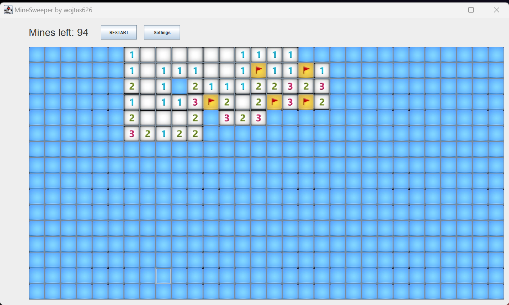

# Minesweeper

It's my first "big" GUI application. It was written when I was 17.

It's a clone from Windows.
It supports flags on right mouse button and clears all fields around on middle mouse button (if the number of surrounding flags is the same as the mines number).

